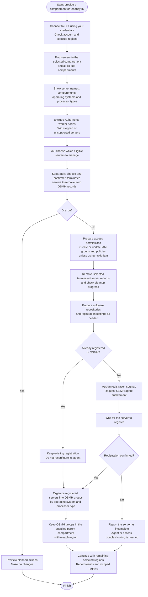

> This diagram documents the earlier direct-onboarding workflow. The default
> command now selects and tags instances; a scheduled OCI Function runs the
> onboarding phase. See [README.md](README.md) for the current workflow.

